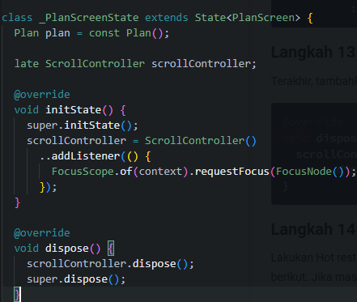
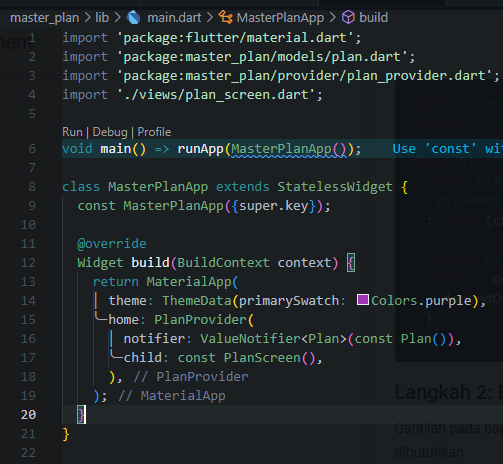

# **#10 | Dasar State Management**

**NIM** = 2241720056

**Nama** = Dhika Wahyu Nugroho

**Kelas** = TI-3F

**No Absen** = 06

# Praktikum 1: Dasar State dengan Model-View

## Langkah 1: Buat Project Baru

 

 

## Langkah 2: Membuat model task.dart

 

## Langkah 3: Buat file plan.dart

 

## Langkah 4: Buat file data_layer.dart

 

## Langkah 5: Pindah ke file main.dart

 

## Langkah 6: buat plan_screen.dart

~~~dart
import '../models/data_layer.dart';
import 'package:flutter/material.dart';

class PlanScreen extends StatefulWidget {
  const PlanScreen({super.key});

  @override
  State createState() => _PlanScreenState();
}

class _PlanScreenState extends State<PlanScreen> {
  Plan plan = const Plan();

  @override
  Widget build(BuildContext context) {
   return Scaffold(
    // ganti ‘Namaku' dengan Nama panggilan Anda
    appBar: AppBar(title: const Text('Master Plan Namaku')),
    body: _buildList(),
    floatingActionButton: _buildAddTaskButton(),
   );
  }
}
~~~

## Langkah 7: buat method _buildAddTaskButton()

~~~dart
Widget _buildAddTaskButton() {
    return FloatingActionButton(
        child: const Icon(Icons.add),
        onPressed: () {
        setState(() {
            plan = Plan(
            name: plan.name,
            tasks: List<Task>.from(plan.tasks)..add(const Task()),
            );
        });
        },
    );
}
~~~

## Langkah 8: buat widget _buildList()

~~~dart
Widget _buildList() {
    return ListView.builder(
        itemCount: plan.tasks.length,
        itemBuilder: (context, index) => _buildTaskTile(plan.tasks[index], index),
    );
}
~~~

## Langkah 9: buat widget _buildTaskTile

~~~dart
Widget _buildTaskTile(Task task, int index) {
    return ListTile(
        leading: Checkbox(
            value: task.complete,
            onChanged: (selected) {
            setState(() {
                plan = Plan(
                name: plan.name,
                tasks: List<Task>.from(plan.tasks)
                    ..[index] = Task(
                    description: task.description,
                    complete: selected ?? false,
                    ),
                );
            });
            }),
        title: TextFormField(
        initialValue: task.description,
        onChanged: (text) {
            setState(() {
            plan = Plan(
                name: plan.name,
                tasks: List<Task>.from(plan.tasks)
                ..[index] = Task(
                    description: text,
                    complete: task.complete,
                ),
            );
            });
        },
        ),
    );
}
~~~

## Langkah 10: Tambah Scroll Controller

 

## Langkah 11: Tambah Scroll Listener

 

## Langkah 12: Tambah controller dan keyboard behavior

 

## Langkah 13: Terakhir, tambah method dispose()

 

## Langkah 14: Hasil

 

# Tugas Praktikum 1: Dasar State dengan Model-View

- 2. Jelaskan maksud dari langkah 4 pada praktikum tersebut! Mengapa dilakukan demikian?
    - **Jawaban**: Dapat memudahkan import pada kedua hal tersebut (plan.dart dan task.dart) pada file lain yang membutuhkan keduanya dengan hanya satu perintah impor.

- 3. Mengapa perlu variabel plan di langkah 6 pada praktikum tersebut? Mengapa dibuat konstanta?
    - **Jawaban**: Variabel plan diperlukan untuk menyimpan data dalam widget PlanScreen dan untuk memastikan nilai tidak berubah, dibuat menjadi konstanta.

- 4. Lakukan capture hasil dari Langkah 9 berupa GIF, kemudian jelaskan apa yang telah Anda buat!
    - **Jawaban**: Membuat plan apliaksi agar memudahkan kita untuk membuat planning kedepannya. 
     .

- 5. Apa kegunaan method pada Langkah 11 dan 13 dalam lifecyle state ?
    - **Jawaban**: intState digunakan untuk melakukan persiapan awal seperti membuat dan mengatur pada scrollController. Sedangkan pada dispose digunakan untuk membersihkan dan membuang resource yang tidak digunakan, seperti pada scrollController.

# Praktikum 2: Mengelola Data Layer dengan InheritedWidget dan InheritedNotifier

## Langkah 1: Buat file plan_provider.dart

 

## Langkah 2: Edit main.dart

 

## Langkah 3: Tambah method pada model plan.dart

 

## Langkah 5: Edit method _buildAddTaskButton

 

## Langkah 6: Edit method _buildTaskTile

 

## Langkah 7: Edit _buildList

 

## Langkah 9: Tambah widget SafeArea

 

# Tugas Praktikum 2: InheritedWidget

- 2. Jelaskan mana yang dimaksud InheritedWidget pada langkah 1 tersebut! Mengapa yang digunakan InheritedNotifier?
    - **Jawaban**: inheritedWidget adalah kelas dasar yang digunakan untuk meneruskan data ke widget di bawahnya dalam widget tree. IngeritedNotifier digunakan agar data yang diteruskan dapat memicu pembaruan otomatis pada widget yang bergantung pada data tersebut.

- 3. Jelaskan maksud dari method di langkah 3 pada praktikum tersebut! Mengapa dilakukan demikian?
    - **Jawaban**: Method completedCount akan menghitung jumlah tugas yang selesai, dan completenessMessage menghasilkan pesan yang menunjukkan berapa banyak tugas yang selesai dari total tugas.

- 4. Lakukan capture hasil dari Langkah 9 berupa GIF, kemudian jelaskan apa yang telah Anda buat!
    - **Jawaban**: Membuat footer dengan count agar ketika terdapat task yang sudah selesai lalu di centang, akan dihitung 1 dari tugas tersebut telah terpenuhi. 
    

# Praktikum 3: Membuat State di Multiple Screens

## Langkah 1: Edit PlanProvider

 

## Langkah 3: Edit plan_screen.dart

 

## Langkah 5: Tambah getter Plan

 

## Langkah 6: Method initState()

 

## Langkah 7: Widget build

 

## Langkah 8: Edit _buildTaskTile

 

## Langkah 9: Buat screen baru

 

 

## Langkah 10: Pindah ke class _PlanCreatorScreenState

 

## Langkah 11: Pindah ke method build

 

## Langkah 12: Buat widget _buildListCreator

 

## Langkah 13: Buat void addPlan()

 

## Langkah 14: Buat widget _buildMasterPlans()

 

# Tugas Praktikum 3: State di Multiple Screens

- 2. Berdasarkan Praktikum 3 yang telah Anda lakukan, jelaskan maksud dari gambar diagram berikut ini! 
 
    - **Jawaban**: Diagram ini menggambarkan proses navigasi dalam aplikasi Flutter dengan menggunakan Navigator.push untuk berpindah dari satu tampilan ke tampilan lainnya. Di sisi kiri, terlihat struktur tampilan awal (PlanCreatorScreen) yang memiliki TextField dan ListView dalam sebuah Column. Selanjutnya, dengan menggunakan Navigator.push, aplikasi akan menampilkan tampilan baru di sisi kanan, yang dinamakan PlanScreen, lengkap dengan komponen tambahan seperti Scaffold, SafeArea, dan Text.

- 3. Lakukan capture hasil dari Langkah 14 berupa GIF, kemudian jelaskan apa yang telah Anda buat!
    - **Jawaban**: Jadi pada prakikum ke-3, membuat screen baru untuk membuat setiap plan agar lebih terstruktur dalam task yang akan dikerjakan pada masing masing plan. 
    