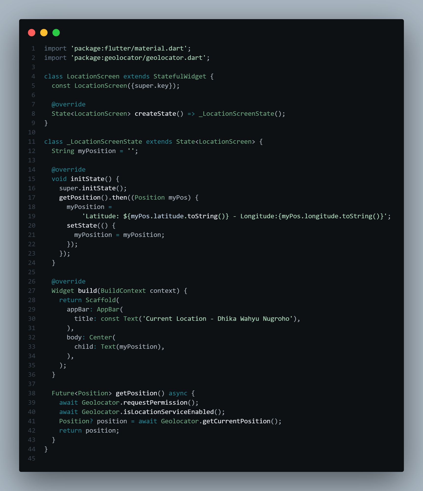

# **#11 | Pemrograman Asynchronous**

**NIM** = 2241720056

**Nama** = Dhika Wahyu Nugroho

**Kelas** = TI-3F

**No Absen** = 06

# Praktikum 1: Mengunduh Data dari Web Service (API)

## Langkah 1: Buat Project Baru

 

 

## Langkah 2: Cek file pubspec.yaml

 

## Langkah 3: Buka file main.dart

- Soal 1: Tambahkan nama panggilan Anda pada title app sebagai identitas hasil pekerjaan Anda.

 

## Langkah 4: Tambah method getData()

 

- Soal 2: 
    - Carilah judul buku favorit Anda di Google Books, lalu ganti ID buku pada variabel path di kode tersebut. Caranya ambil di URL browser Anda seperti gambar berikut ini. 
    - Kemudian cobalah akses di browser URI tersebut dengan lengkap seperti ini. Jika menampilkan data JSON, maka Anda telah berhasil. Lakukan capture milik Anda dan tulis di README pada laporan praktikum. Lalu lakukan commit dengan pesan "W11: Soal 2". 
     

## Langkah 5: Tambah kode di ElevatedButton

 

- Soal 3 
    - Jelaskan maksud kode langkah 5 tersebut terkait substring dan catchError! 
        - Jadi, substring tersebut untuk mengambil bagian tertentu dari string berdasarkan indeks awal dan akhir. Sedangkan untuk catchError akan menangani error yang terjadi selama eksekusi asynchronus. 
    - Capture hasil praktikum Anda berupa GIF dan lampirkan di README. Lalu lakukan commit dengan pesan "W11: Soal 3". 
     

# Praktikum 2: Menggunakan await/async untuk menghindari callbacks

## Langkah 1: Buka file main.dart

 

## Langkah 2: Tambah method count()

 

## Langkah 3: Panggil count()

 

## Langkah 4: Run

- Soal 4 
    - Jelaskan maksud kode langkah 1 dan 2 tersebut! 
        - Jadi pada kode tersebut akan menghitung dengan jeda durasi selama 3 detik yang dipanggil pada fungsi returnOne, Two, Three Async lalu hasil dari return tersebut akan ditambah dan ditampilkan. 
    - Capture hasil praktikum Anda berupa GIF dan lampirkan di README. Lalu lakukan commit dengan pesan "W11: Soal 3". 
     

# Praktikum 3: Menggunakan Completer di Future

## Langkah 1: Buka main.dart

 

## Langkah 2: Tambahkan variabel dan method

 

## Langkah 3: Ganti isi kode onPressed()

 

## Langkah 4:

 

- Soal 5 
    - Jelaskan maksud kode langkah 2 tersebut! 
        - Jadi pada langkah 2 bertujuan untuk mengontrol penyelesaian menggunakan Completer dengan jeda 5 detik nilai 42 akan dikirimkan. 
    - Capture hasil praktikum Anda berupa GIF dan lampirkan di README. Lalu lakukan commit dengan pesan "W11: Soal 5". 
     

## Langkah 5: Ganti method calculate()

 

## Langkah 6: Pindah ke onPressed()

 

- Soal 6 
    - Jelaskan maksud perbedaan kode langkah 2 dengan langkah 5-6 tersebut! 
        - Jadi perbedaan kode tersebut adalah terdapat pencegahan error, ketika terjadi error pada pengiriman nilai, akan menampilkan 'An error occured' sehingga aplikasi masih berjalan.  
    - Capture hasil praktikum Anda berupa GIF dan lampirkan di README. Lalu lakukan commit dengan pesan "W11: Soal 6". 
     

# Praktikum 4: Memanggil Future secara paralel

## Langkah 1: Buka file main.dart

 

## Langkah 2: Edit onPressed()

 

## Langkah 3: Run

- Soal 7 
    - Capture hasil praktikum Anda berupa GIF dan lampirkan di README. Lalu lakukan commit dengan pesan "W11: Soal 7". 
     

## Langkah 4: Ganti variabel futureGroup

 

- Soal 8 
    - Jelaskan maksud perbedaan kode langkah 1 dan 4! 
        - Jadi perbedaannya adalah pada FutureGroup fleksible untuk penambahan future secara dinamis, sedangkan Future.wait lebih sederhana tetapi membutuhkan daftar future yang sudah lengkap saat dipanggil. 

# Praktikum 5: Menangani Respon Error pada Async Code

## Langkah 1: Buka file main.dart

 

## Langkah 2: ElevatedButton

 

## Langkah 3: Run

- Soal 9 
    - Capture hasil praktikum Anda berupa GIF dan lampirkan di README. Lalu lakukan commit dengan pesan "W11: Soal 9". 
     

## Langkah 4: Tambah method handleError()

 

- Soal 10 
    - Panggil method handleError() tersebut di ElevatedButton, lalu run. Apa hasilnya? Jelaskan perbedaan kode langkah 1 dan 4! 
        - Perbedaannya adalah terdapat handle dari function returnError() ketika function tersebut terjadi error. 
        - Hasil 
         

# Praktikum 6: Menggunakan Future dengan StatefulWidget

## Langkah 1: install plugin geolocator

 

## Langkah 2: Tambah permission GPS

 

## Langkah 3: Buat file geolocation.dart

 

## Langkah 4: Buat StatefulWidget

 

## Langkah 5: Isi kode geolocation.dart

 

- Soal 11
    - Tambahkan nama panggilan Anda pada tiap properti title sebagai identitas pekerjaan Anda.

## Langkah 6: Edit main.dart

 

## Langkah 7: Run

 

## Langkah 8: Tambahkan animasi loading

 

- Soal 12 
    - Jika Anda tidak melihat animasi loading tampil, kemungkinan itu berjalan sangat cepat. Tambahkan delay pada method getPosition() dengan kode await Future.delayed(const Duration(seconds: 3)); 
    - Apakah Anda mendapatkan koordinat GPS ketika run di browser? Mengapa demikian?
        - Ya, saya mendapatkan koordinat GPS dikarenakan memiliki izin untuk lokasi. 
        - Hasil 
         
    - Capture hasil praktikum Anda berupa GIF dan lampirkan di README. Lalu lakukan commit dengan pesan "W11: Soal 12". 
     

# Praktikum 7: Manajemen Future dengan FutureBuilder

## Langkah 1: Modifikasi method getPosition()

 

## Langkah 2: Tambah variabel

 

## Langkah 3: Tambah initState()

 

## Langkah 4: Edit method build()

 

- Soal 13 
    - Apakah ada perbedaan UI dengan praktikum sebelumnya? Mengapa demikian? 
        - Terdapat perubahan pada title dan juga isi content.
    - Capture hasil praktikum Anda berupa GIF dan lampirkan di README. Lalu lakukan commit dengan pesan "W11: Soal 13". 
     
    - Seperti yang Anda lihat, menggunakan FutureBuilder lebih efisien, clean, dan reactive dengan Future bersama UI. 

## Langkah 5: Tambah handling error

 

- Soal 14 
    - Apakah ada perbedaan UI dengan langkah sebelumnya? Mengapa demikian? 
        - Tidak ada. 
    - Capture hasil praktikum Anda berupa GIF dan lampirkan di README. Lalu lakukan commit dengan pesan "W11: Soal 14". 
        - Hasil Berhasil 
         
        - Hasil Error 
         

# Praktikum 8: Navigation route dengan Future Function

## Langkah 1: Buat file baru navigation_first.dart

 

## Langkah 2: Isi kode navigation_first.dart

 

- Soal 15 
    - Tambahkan nama panggilan Anda pada tiap properti title sebagai identitas pekerjaan Anda. 
    - Silakan ganti dengan warna tema favorit Anda. 

## Langkah 3: Tambah method di class _NavigationFirstState

 

## Langkah 4: Buat file baru navigation_second.dart

 

## Langkah 5: Buat class NavigationSecond dengan StatefulWidget

 

## Langkah 6: Edit main.dart

 

## Langkah 7: Run

- Soal 16 
    - Cobalah klik setiap button, apa yang terjadi ? Mengapa demikian ? 
        - Ketika mengklik Change Color, akan menyediakan 3 button dengan 3 nama warna yang berbeda. Ketika salah satu button dipencet, contoh button Red akan menampilkan background berwarna merah. 
    - Gantilah 3 warna pada langkah 5 dengan warna favorit Anda! 
    - Capture hasil praktikum Anda berupa GIF dan lampirkan di README. Lalu lakukan commit dengan pesan "W11: Soal 16". 
     

# Praktikum 9: Memanfaatkan async/await dengan Widget Dialog

## Langkah 1: Buat file baru navigation_dialog.dart

 

## Langkah 2: Isi kode navigation_dialog.dart

 

## Langkah 3: Tambah method async

 

## Langkah 4: Panggil method di ElevatedButton

 

## Langkah 5: Edit main.dart

 

## Langkah 6: Run

- Soal 17 
    - Cobalah klik setiap button, apa yang terjadi ? Mengapa demikian ? 
        - Ketika mengklik Change Color, akan muncul pop up untuk memilih ingin warna apa. Contoh memilih warna Red, akan mengganti background menjadi warna merah. 
    - Gantilah 3 warna pada langkah 3 dengan warna favorit Anda! 
    - Capture hasil praktikum Anda berupa GIF dan lampirkan di README. Lalu lakukan commit dengan pesan "W11: Soal 17". 
     
