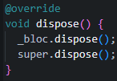

# **#12 | Lanjutan State Management dengan Streams**

**NIM** = 2241720056

**Nama** = Dhika Wahyu Nugroho

**Kelas** = TI-3F

**No Absen** = 06

# Praktikum 1: Mengunduh Data dari Web Service (API)

## Langkah 1: Buat Project Baru

 

## Langkah 2: Buka file main.dart

 

- Soal 1
    - Tambahkan nama panggilan Anda pada title app sebagai identitas hasil pekerjaan Anda.
    - Gantilah warna tema aplikasi sesuai kesukaan Anda.
    - Lakukan commit hasil jawaban Soal 1 dengan pesan "W12: Jawaban Soal 1"

## Langkah 3: Buat file baru stream.dart

 

## Langkah 4: Tambah variabel colors

 

- Soal 2
    - Tambahkan 5 warna lainnya sesuai keinginan Anda pada variabel colors tersebut.
        - Jawaban:  
         
    - Lakukan commit hasil jawaban Soal 2 dengan pesan "W12: Jawaban Soal 2"

## Langkah 5: Tambah method getColors()

 

## Langkah 6: Tambah perintah yield*

 

- Soal 3
    - Jelaskan fungsi keyword yield* pada kode tersebut!
        - Jawaban: Fungsi dari yield* untuk meneruskan semua data dari stream lain ke stream yang sedang berjalan.
    - Apa maksud isi perintah kode tersebut?
        - Jawaban: Dari kode tersebut akan menampilkan color secara urut seperti red->blue->green->red->... setiap 1 detik.
    - Lakukan commit hasil jawaban Soal 3 dengan pesan "W12: Jawaban Soal 3"

## Langkah 7: Buka main.dart

 

## Langkah 8: Tambah variabel

 

## Langkah 9: Tambah method changeColor()

 

## Langkah 10: Lakukan override initState()

 

## Langkah 11: Ubah isi Scaffold()

 

## Langkah 12: Run

 

- Soal 4
    - Capture hasil praktikum Anda berupa GIF dan lampirkan di README.
        - Jawaban:  
         
    - Lakukan commit hasil jawaban Soal 4 dengan pesan "W12: Jawaban Soal 4"

## Langkah 13: Ganti isi method changeColor()

 

- Soal 5
    - Jelaskan perbedaan menggunakan listen dan await for (langkah 9) !
        - Jawaban: Jadi untuk listen akan melakukan perubahan secara langsung dengan cara callback setiap kali ada event, sedangkan await for akan memproses event satu per satu secara sinkron cocok digunakan untuk stream yang memiliki akhir.
    - Lakukan commit hasil jawaban Soal 5 dengan pesan "W12: Jawaban Soal 5"

# Praktikum 2: Stream controllers dan sinks

## Langkah 1: Buka file stream.dart

 

## Langkah 2: Tambah class NumberStream

 

## Langkah 3: Tambah StreamController

 

## Langkah 4: Tambah method addNumberToSink

 

## Langkah 5: Tambah method close()

 

## Langkah 6: Buka main.dart

 

## Langkah 7: Tambah variabel

 

## Langkah 8: Edit initState()

 

## Langkah 9: Edit dispose()

 

## Langkah 10: Tambah method addRandomNumber()

 

## Langkah 11: Edit method build()

 

## Langkah 12: Run

 

- Soal 6
    - Jelaskan maksud kode langkah 8 dan 10 tersebut!
        - Jawaban: Kode pada Langkah 8 digunakan untuk melakukan stream angka atau menampilkan angka secara langsung di mana variable event di dapatkan dari hasil random number. Sedangkan kode pada Langkah 10 bertujuan untuk mendapatkan angka dari 1 sampai 10 secara random.
    - Capture hasil praktikum Anda berupa GIF dan lampirkan di README.
        - Jawaban:  
         
    - Lalu lakukan commit dengan pesan "W12: Jawaban Soal 6".

## Langkah 13: Buka stream.dart

 

## Langkah 14: Buka main.dart

 

## Langkah 15: Edit method addRandomNumber()

 

- Soal 7
    - Jelaskan maksud kode langkah 13 sampai 15 tersebut!
        - Jawaban: Pada kode Langkah 13 bertujuan untuk mengirimkan error ke aliran stream jika terjadi error dengan pesan 'error;. Pada kode Langkah 15 terdapat numberStream.addError() maka nilai yang ditampilkan adalah -1.
    - Kembalikan kode seperti semula pada Langkah 15, comment addError() agar Anda dapat melanjutkan ke praktikum 3 berikutnya.
    - Lalu lakukan commit dengan pesan "W12: Jawaban Soal 6".

## Langkah 1: Buka main.dart

 

## Langkah 2: Tambahkan kode ini di initState

 

## Langkah 3: Tetap di initState

 

## Langkah 4: Run

 

- Soal 8
    - Jelaskan maksud kode langkah 1-3 tersebut!
        - Jawaban: Maksud kode dari Langkah 1-3 yaitu untuk melakukan transform pada nilai atau value dari 1-10 dengan * 10.
    - Capture hasil praktikum Anda berupa GIF dan lampirkan di README.
        - Jawaban:  
         
    - Lalu lakukan commit dengan pesan "W12: Jawaban Soal 8".

# Praktikum 4: Subscribe ke stream events

## Langkah 1: Tambah variabel

 

## Langkah 2: Edit initState()

 

## Langkah 3: Tetap di initState()

 

## Langkah 4: Tambah properti onDone()

 

## Langkah 5: Tambah method baru

 

## Langkah 6: Pindah ke method dispose()

 

## Langkah 7: Pindah ke method build()

 

## Langkah 8: Edit method addRandomNumber()

 

## Langkah 9: Run

 

## Langkah 10: Tekan button ‘Stop Subscription'

 

- Soal 9
    - Jelaskan maksud kode langkah 2, 6 dan 8 tersebut!
        - Jawaban: Maksud dari kode Langkah 2, 6, dan 8 yaitu untuk menghentikan langganan dengan pada langkah 6, sedangkan untuk langkah 2 berjalan seperbiasa yaitu mengambil number dari event randomnumber, pada langkah 8 memberi persyaratan di mana ketika terjadi menghentikan langganan, nilai menjadi -1.
    - Capture hasil praktikum Anda berupa GIF dan lampirkan di README.
        - Jawaban:  
         
    - Lalu lakukan commit dengan pesan "W12: Jawaban Soal 9".

## Praktikum 5: Multiple stream subscriptions

## Langkah 1: Buka file main.dart

 

## Langkah 2: Edit initState()

 

## Langkah 3: Run

 

- Soal 10
    - Jelaskan mengapa error itu bisa terjadi ?
        - Jawaban: Dikarenakan stream bersifat single subcription, maka tidak bisa menampilkan 2 stream secara bersamaan. Untuk menampilkann kedua stream tersebut perlu broadcast.

## Langkah 4: Set broadcast stream

 

## Langkah 5: Edit method build()

 

## Langkah 6: Run

 

- Soal 11
    - Jelaskan mengapa hal itu bisa terjadi ?
        - Jawaban: Hal tersebut bisa terjadi dikarenakan terdapat 2 stream sehingga menampilkan values dari 2 stream tersebut, dan pada stream sudah di beri asBroadCastStream() sehingga bisa menampilkan 2 stream sekaligus.
    - Capture hasil praktikum Anda berupa GIF dan lampirkan di README.
        - Jawaban:  
         
    - Lalu lakukan commit dengan pesan "W12: Jawaban Soal 10,11".

# Praktikum 6: StreamBuilder

## Langkah 1: Buat Project Baru

 

## Langkah 2: Buat file baru stream.dart

 

## Langkah 3: Tetap di file stream.dart

 

## Langkah 4: Edit main.dart

 

## Langkah 5: Tambah variabel

 

## Langkah 6: Edit initState()

 

## Langkah 7: Edit method build()

 

## Langkah 8: Run

 

- Soal 12
    - Jelaskan maksud kode pada langkah 3 dan 7 !
        - Jawaban: Kode Langkah 3 bertujuan untuk mendapatkan nilai angka secara random setiap 1 detik lalu melakukan return dan juga menggunakan fungsi yield*, sedangkan pada kode Langkah 7 bertujuan untuk menampilkan nilai random yang sudah di dapatkan dengan terdapat persyaratan seperti mencegah error ketika nilai tidak di dapatkan.
    - Capture hasil praktikum Anda berupa GIF dan lampirkan di README.
        - Jawaban:  
         
    - Lalu lakukan commit dengan pesan "W12: Jawaban Soal 12".

# Praktikum 7: BLoC Pattern

## Langkah 1: Buat Project baru

 

## Langkah 2: Isi kode random_bloc.dart

 

## Langkah 3: Buat class RandomNumberBloc()

 

## Langkah 4: Buat variabel StreamController

 

## Langkah 5: Buat constructor

 

## Langkah 6: Buat method dispose()

 

## Langkah 7: Edit main.dart

 

## Langkah 8: Buat file baru random_screen.dart

 

## Langkah 9: Lakukan impor material dan random_bloc.dart

 

## Langkah 10: Buat StatefulWidget RandomScreen

 

## Langkah 11: Buat variabel

 

## Langkah 12: Buat method dispose()

 

## Langkah 13: Edit method build()

 

 

- Soal 13
    - Jelaskan maksud praktikum ini ! Dimanakah letak konsep pola BLoC-nya ?
        - Jawaban: Praktikum tersebut menerapkan pola BLoC (Business Logic Component) dengan menggunakan StreamController untuk memisahkan logika bisnis dan tampilan UI. Input (Sink) menerima event untuk menghasilkan angka acak, sementara Output (Stream) mengirimkan angka tersebut ke UI menggunakan StreamBuilder. Ketika tombol ditekan, angka acak dihasilkan dan ditampilkan di layar.
    - Capture hasil praktikum Anda berupa GIF dan lampirkan di README.
        - Jawaban:  
         
    - Lalu lakukan commit dengan pesan "W12: Jawaban Soal 13".
