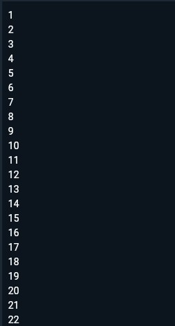
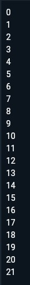

# **#03 | Pengantar Bahasa Pemrograman Dart - Bagian 2**

**NiM** = 2241720056

**Nama** = Dhika Wahyu Nugroho

**Kelas** = TI-3F

**No Absen** = 06

# Praktikum 1: Menerapkan Control Flows("if/else")

## Langkah 1

- Ketik atau salin kode program berikut ke dalam fungsi main().

~~~dart
String test = "test2";
if (test == "test1") {
   print("Test1");
} else If (test == "test2") {
   print("Test2");
} Else {
   print("Something else");
}

if (test == "test2") print("Test2 again");
~~~

## Langkah 2

- Silakan coba eksekusi (Run) kode pada langkah 1 tersebut. Apa yang terjadi? Jelaskan!

- **Jawaban** : Terjadi error dikarenakan pada persyaratan else If dan Else menggunakan huruf besar.

Hasil setelah diperbaiki

'
## Langkah 3

Tambahkan kode program berikut, lalu coba eksekusi (Run) kode Anda.

~~~dart
String test = "true";
if (test) {
   print("Kebenaran");
}
~~~

Apa yang terjadi ? Jika terjadi error, silakan perbaiki namun tetap menggunakan if/else.

- **Jawaban** : Terjadi Error.
- Perbaikan : Merubah tipe data String menjadi boolean.

~~~dart
bool test3 = true;
  
  if (test3) {
    print("Kebenaran");
  }
~~~

**Hasil Praktikum 1:**

# Praktikum 2: Menerapkan Perulangan "while" dan "do-while"

## Langkah 1

Ketik atau salin kode program berikut ke dalam fungsi main().

~~~dart
while (counter < 33) {
  print(counter);
  counter++;
}
~~~

## Langkah 2

Silakan coba eksekusi (Run) kode pada langkah 1 tersebut. Apa yang terjadi? Jelaskan! Lalu perbaiki jika terjadi error.

- **Jawaban** : Ketika di run kode tersebut akan error dikarenakan pada kode tersebut tidak mendeklarasikan counter.
- Perbaikan : Membuat variable counter bertipe data integer.

~~~dart
void main() {
  int counter = 1;

  while (counter < 33) {
    print(counter);
    counter++;
  }
}
~~~

## Langkah 3

Tambahkan kode program berikut, lalu coba eksekusi (Run) kode Anda.

- **Jawaban** : Tidak ada error.

**Hasil Praktikum 2:**

# Praktikum 3: Menerapkan Perulangan "for" dan "break-continue"

## Langkah 1

Ketik atau salin kode program berikut ke dalam fungsi main().

~~~dart
for (Index = 10; index < 27; index) {
  print(Index);
}
~~~

## Langkah 2

Silakan coba eksekusi (Run) kode pada langkah 1 tersebut. Apa yang terjadi? Jelaskan! Lalu perbaiki jika terjadi error.
- **Jawaban** : Terjadi error dikarenakan pada variable index tidak memiliki tipe data yang dideklarasikan. Selain itu, pada perulangan tersebut akan terjadi infinite loop karena nilai index tidak bertambah. Untuk menghindari infinite loop, perlu ditambahkan increment seperti index++ atau index += 1 agar nilai index tidak terus memenuhi syarat loop.

## Langkah 3

Tambahkan kode program berikut di dalam for-loop, lalu coba eksekusi (Run) kode Anda.

~~~dart
If (Index == 21) break;
  Else If (index > 1 || index < 7) continue;
print(index);
~~~
Apa yang terjadi ? Jika terjadi error, silakan perbaiki namun tetap menggunakan for dan break-continue.
- **Jawaban** : Terjadi error dikarenakan terdapat kesalahan pada penerapan if else dan juga huruf If dan Else nya yang seharusnya kecil.

**Perbaikan** : Nilai index diganti menjadi 0 agar pada persyaratan else if bisa dijalankan. Pada perulangan tersebut ketika nilai belum menyentuk angka 21, akan terus berulang.
~~~dart
void main() {
  for (int index = 0; index < 27; index++) {
    print(index);

    if (index == 21){
      break;
    }
    else if (index > 1 || index < 7){
      continue;
    }

    print(index);
  }
}
~~~

**Hasil Praktikum 3:**

# Tugas Praktikum

## 2. Buatlah sebuah program yang dapat menampilkan bilangan prima dari angka 0 sampai 201 menggunakan Dart. Ketika bilangan prima ditemukan, maka tampilkan nama lengkap dan NIM Anda.

**Jawaban** :
~~~dart
void main() {
  String nama = 'Dhika Wahyu Nugroho';
  String nim = '2241720056';

  for (int angka = 0; angka <= 201; angka++) {
    bool isPrima = true;
    if (angka < 2) {
      isPrima = false;
    } else {
      for (int i = 2; i * i <= angka; i++) {
        if (angka % i == 0) {
          isPrima = false;
          break;
        }
      }
    }

    if (isPrima) {
      print('$angka adalah bilangan prima.');
      print('Nama: $nama, NIM: $nim\n');
    }
  }
}
~~~

**Output:**

