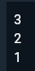

# **#04 | Pengantar Bahasa Pemrograman Dart - Bagian 3**

**NiM** = 2241720056

**Nama** = Dhika Wahyu Nugroho

**Kelas** = TI-3F

**No Absen** = 06

# Praktikum 1: Eksperimen Tipe Data List

## Langkah 1

- Ketik atau salin kode program berikut ke dalam void main().
  - Kode
    ~~~dart
    var list = [1, 2, 3];
    assert(list.length == 3);
    assert(list[1] == 2);
    print(list.length);
    print(list[1]);

    list[1] = 1;
    assert(list[1] == 1);
    print(list[1]);
    ~~~

## Langkah 2

- Silakan coba eksekusi (Run) kode pada langkah 1 tersebut. Apa yang terjadi? Jelaskan!

  **Jawaban** : Output tidak error. Terdapat deklarasi dan inisialisasi variable baru bernama list bertipe data array dengan value [1, 2, 3] dengan kondisi :
    - assert list.length == 3 dan menghasilkan true dikarenakan list mempunyai value sepanjang 3 akan melanjutkan kode selanjutnya.
    - assert list[1] == 2 dan menghasilkan true dikarenakan array ke-1 dari list adalah 2 dan array dimulai dari 0.
    - list[1] = 1, terdapat pergantian value untuk array ke-1 pada list.
    - assert list[1] == 1 akan menghasilkan true dikarenakan list pada array ke-1 memiliki value 1 pada kode list[1] = 1.

  **Output:** 
  

## Langkah 3

- Ubah kode pada langkah 1 menjadi variabel final yang mempunyai index = 5 dengan default value = null. Isilah nama dan NIM Anda pada elemen index ke-1 dan ke-2. Lalu print dan capture hasilnya.

  

  Apa yang terjadi ? Jika terjadi error, silakan perbaiki.
  **Jawaban:** Terjadi erro
  **Perbaikan:**
  ~~~dart
  void main() {
    final List<String?> list = List.filled(5, null);
    
    list[1] = 'Dhika Wahyu Nugroho';
    list[2] = '2241720056';

    assert (list.length == 5);
    print(list);
  }
  ~~~

  **Output** 
  

# Praktikum 2: Eksperimen Tipe Data Set

## Langkah 1

- Ketik atau salin kode program berikut ke dalam fungsi main().

  ~~~dart
  var halogens = {'fluorine', 'chlorine', 'bromine', 'iodine', 'astatine'};

  print(halogens);
  ~~~

## Langkah 2

- Silakan coba eksekusi (Run) kode pada langkah 1 tersebut. Apa yang terjadi? Jelaskan! Lalu perbaiki jika terjadi error.

  **Output** 
  

  **Jawaban** : Tidak terjadi error dikarenakan pada variable halogens merupakan Set value yang dideklariskan dalam tanda petik dianggap sebagai nilai String.

## Langkah 3

- Tambahkan kode program berikut, lalu coba eksekusi (Run) kode Anda.

  ~~~dart
  var names1 = <String>{};
  Set<String> names2 = {}; // This works, too.
  var names3 = {}; // Creates a map, not a set.

  print(names1);
  print(names2);
  print(names3);
  ~~~

- Apa yang terjadi ? Jika terjadi error, silakan perbaiki namun tetap menggunakan ketiga variabel tersebut. Tambahkan elemen nama dan NIM Anda pada kedua variabel Set tersebut dengan dua fungsi berbeda yaitu .add() dan .addAll(). Untuk variabel Map dihapus, nanti kita coba di praktikum selanjutnya.

- **Jawaban** : Yang terjadi adalah menghasilkan output kosong tanpa ada isi.
  **Output Sebelum NIM dan Nama** 
   

  **Code**
  ~~~dart
  void main(){
    var names1 = <String>{};
    Set<String> names2 = {}; // This works, too.
    var names3 = {}; // Creates a map, not a set.
    
    names1.add("Dhika");
    names1.add("Wahyu");
    names1.add("Nugroho");
    names2.addAll({"Dhika Wahyu Nugroho", "2241720056"});

    print(names1);
    print(names2);
    print(names3);
  }
  ~~~
  **Output NIM dan Nama** 
  

# Praktikum 3: Eksperimen Tipe Data Maps

## Langkah 1

- Ketik atau salin kode program berikut ke dalam fungsi main().

  ~~~dart
  var gifts = {
    // Key:    Value
    'first': 'partridge',
    'second': 'turtledoves',
    'fifth': 1
  };

  var nobleGases = {
    2: 'helium',
    10: 'neon',
    18: 2,
  };

  print(gifts);
  print(nobleGases);
  ~~~

## Langkah 2

- Silakan coba eksekusi (Run) kode pada langkah 1 tersebut. Apa yang terjadi? Jelaskan! Lalu perbaiki jika terjadi error.

  **Output** 
  

  **Jawaban** : Tidak terjadi error dikarenakan pada variable gifts dan nobleGases bertipe Map terdapat key dan value. Pada gifts memiliki key berupa String dan nobleGases memiliki key berupa int.

## Langkah 3

- Tambahkan kode program berikut, lalu coba eksekusi (Run) kode Anda.

  ~~~dart
  var mhs1 = Map<String, String>();
  gifts['first'] = 'partridge';
  gifts['second'] = 'turtledoves';
  gifts['fifth'] = 'golden rings';

  var mhs2 = Map<int, String>();
  nobleGases[2] = 'helium';
  nobleGases[10] = 'neon';
  nobleGases[18] = 'argon';
  ~~~

- Apa yang terjadi ? Jika terjadi error, silakan perbaiki.
- **Jawaban:** Tidak error, kode tersebut akan mencetak value dari gifts dan nobleGases setelah perubahan,

  **Output** 
  

- Tambahkan elemen nama dan NIM Anda pada tiap variabel di atas (gifts, nobleGases, mhs1, dan mhs2).

  **Code**
  ~~~dart
  void main() {
    var gifts = {
      'first': 'partridge',
      'second': 'turtledoves',
      'fifth': 'golden rings',
      'name': 'Dhika Wahyu N',
      'NIM': '2241720056'
    };

    var nobleGases = {
      2: 'helium',
      10: 'neon',
      18: 'argon',
      20: 'Dhika Wahyu Nugroho',
      21: '2241720056'
    };

    var mhs1 = Map<String, String>();
    mhs1['name'] = 'Dhika Wahyu N';
    mhs1['NIM'] = '2241720056';

    var mhs2 = Map<int, String>();
    mhs2[1] = 'Dhika Wahyu Nugroho';
    mhs2[2] = '2241720056';

    print('Gifts: $gifts');
    print('Noble Gases: $nobleGases');
    print('MHS1: $mhs1');
    print('MHS2: $mhs2');
  }
  ~~~

  **Output** 
  

# Praktikum 4: Eksperimen Tipe Data List: Spread dan Control-flow Operators

## Langkah 1

- Ketik atau salin kode program berikut ke dalam fungsi main().

  ~~~dart
  var list = [1, 2, 3];
  var list2 = [0, ...list];
  print(list1);
  print(list2);
  print(list2.length);
  ~~~

## Langkah 2

- Silakan coba eksekusi (Run) kode pada langkah 1 tersebut. Apa yang terjadi? Jelaskan! Lalu perbaiki jika terjadi error.

  **Output** 
  

  **Jawaban** : Terjadi error dikarenakan pada variable list1 tidak deklarasikan.

  **Perbaikan** Dengan cara menyesuaikan nama variable yang digunakan. Pada list1 menghapus angka 1 sehingga menjadi list.
  ~~~dart
  void main() {
    var list = [1, 2, 3];
    var list2 = [0, ...list];
    print(list);
    print(list2);
    print(list2.length);
  }
  ~~~
  **Output** 
  

## Langkah 3

- Tambahkan kode program berikut, lalu coba eksekusi (Run) kode Anda.

  ~~~dart
  list1 = [1, 2, null];
  print(list1);
  var list3 = [0, ...?list1];
  print(list3.length);
  ~~~

- Apa yang terjadi ? Jika terjadi error, silakan perbaiki.

  **Jawaban:** Terjadi error dikarenakan pada list1 tidak dideklarasikan.

  **Output** 
  

  **Perbaikan** Penjelasan : Dari hal tersebut mendeklariaskan list, list2, list1, dan list3. Pada bagian list3, elemen dari list1 digabunggkan menggunakan operator spread.

  **Code**
  ~~~dart
  void main() {
    var list = [1, 2, 3];
    var list2 = [0, ...list];
    print(list);
    print(list2);
    print(list2.length);
    
    var list1 = [1, 2, null];
    print(list1);
    var list3 = [0, ...?list1];
    print(list3.length);
  }
  ~~~

  **Output** 
  

- Tambahkan variabel list berisi NIM Anda menggunakan Spread Operators. Dokumentasikan hasilnya dan buat laporannya!

  **Code**
  ~~~dart
  void main() {
    var list = [1, 2, 3, 2241720056];
    var list2 = [0, ...list];
    print(list);
    print(list2);
    print(list2.length);
    
    var list1 = [1, 2, null];
    print(list1);
    var list3 = [0, ...?list1];
    print(list3.length);
    
    var list_nim = [... list];
    print(list_nim);
  }
  ~~~

  **Output** 
  

## Langkah 4

- Tambahkan kode program berikut, lalu coba eksekusi (Run) kode Anda.

  ~~~dart
  var nav = ['Home', 'Furniture', 'Plants', if (promoActive) 'Outlet'];
  print(nav);
  ~~~

- Apa yang terjadi ? Jika terjadi error, silakan perbaiki. Tunjukkan hasilnya jika variabel promoActive ketika true dan false.

  **Jawaban:** Terjadi error dikarenakan tidak diketahui pada promoActive.

  **Output** 
  

  **Perbaikan**

  **Code True**
  ~~~dart
  void main() {
    var promoActive = true
    var nav = ['Home', 'Furniture', 'Plants', if (promoActive) 'Outlet'];
    print(nav);
  }
  ~~~

  **Output True** 
  

  **Code False**
  ~~~dart
  void main() {
    var promoActive = false
    var nav = ['Home', 'Furniture', 'Plants', if (promoActive) 'Outlet'];
    print(nav);
  }
  ~~~

  **Output False** 
  

## Langkah 5

- Tambahkan kode program berikut, lalu coba eksekusi (Run) kode Anda.

  ~~~dart
  var nav2 = ['Home', 'Furniture', 'Plants', if (login case 'Manager') 'Inventory'];
  print(nav2);
  ~~~

- Apa yang terjadi ? Jika terjadi error, silakan perbaiki. Tunjukkan hasilnya jika variabel login mempunyai kondisi lain.

  **Jawaban:** Terjadi error dikarenakan tidak diketahui pada login.

  **Output** 
  

  **Perbaikan**

  **Code Manager**
  ~~~dart
  void main() {
    var login = 'Manager';
    var nav2 = ['Home', 'Furniture', 'Plants', if (login case 'Manager') 'Inventory'];
    print(nav2);
  }
  ~~~

  **Output Manager** 
  

  **Code Selain Menager**
  ~~~dart
  void main() {
    var login = '';
    var nav2 = ['Home', 'Furniture', 'Plants', if (login case 'Manager') 'Inventory'];
    print(nav2);
  }
  ~~~

  **Output Selain Menager** 
  

  ## Langkah 6

- Tambahkan kode program berikut, lalu coba eksekusi (Run) kode Anda.

  ~~~dart
  var listOfInts = [1, 2, 3];
  var listOfStrings = ['#0', for (var i in listOfInts) '#$i'];
  assert(listOfStrings[1] == '#1');
  print(listOfStrings);
  ~~~

- Apa yang terjadi ? Jika terjadi error, silakan perbaiki. Tunjukkan hasilnya jika variabel login mempunyai kondisi lain.

  **Jawaban:** Tidak terjadi error. Pada listOfStrings berisi elemen dari #0 dan melakukan perulangan menyesuaikan dengan nilai listOfInts.

  **Output** 
  

# Praktikum 5: Eksperimen Tipe Data Records

## Langkah 1

- Ketik atau salin kode program berikut ke dalam fungsi main().

  ~~~dart
  var record = ('first', a: 2, b: true, 'last');
  print(record)
  ~~~

## Langkah 2

- Silakan coba eksekusi (Run) kode pada langkah 1 tersebut. Apa yang terjadi? Jelaskan! Lalu perbaiki jika terjadi error.

  **Output** 
  

  **Jawaban** : Terjadi error dikarenakan kurangnya tanda ; pada print(record).

  **Perbaikan** Dengan cara menyesuaikan nama variable yang digunakan. Pada list1 menghapus angka 1 sehingga menjadi list.
  ~~~dart
  void main() {
    var record = ('first', a: 2, b: true, 'last');
    print(record);
  }
  ~~~
  **Output** 
  

## Langkah 3

- Tambahkan kode program berikut di luar scope void main(), lalu coba eksekusi (Run) kode Anda.

  ~~~dart
  (int, int) tukar((int, int) record) {
    var (a, b) = record;
    return (b, a);
  }
  ~~~

- Apa yang terjadi ? Jika terjadi error, silakan perbaiki. Gunakan fungsi tukar() di dalam main() sehingga tampak jelas proses pertukaran value field di dalam Records.

  **Jawaban:** Tidak terjadi error dikarenakan kode tersebut tidak dipanggil ke dalam fungsi main().

  **Perbaikan**

  **Code**
  ~~~dart
  void main() {
  var record = ('first', a: 2, b: true, 'last');
    print(record);
    
    var tukeran = tukar((1, 2));
    print(tukeran);
  }

  (int, int) tukar((int, int) record) {
    var (a, b) = record;
    return (b, a);
  }
  ~~~

  **Output** 
  

## Langkah 4

- Tambahkan kode program berikut di dalam scope void main(), lalu coba eksekusi (Run) kode Anda.

  ~~~dart
  // Record type annotation in a variable declaration:
  (String, int) mahasiswa;
  print(mahasiswa);
  ~~~

- Apa yang terjadi ? Jika terjadi error, silakan perbaiki. Inisialisasi field nama dan NIM Anda pada variabel record mahasiswa di atas. Dokumentasikan hasilnya dan buat laporannya!

  **Jawaban:** Terjadi error dikarenakan variable mahasiswa tidak dideklarasikan.

  **Output** 
  

  **Perbaikan**

  **Code**
  ~~~dart
  void main() {
    (String, int) mahasiswa = ('Dhika Wahyu Nugroho', 2241720056);
    print(mahasiswa);
  }
  ~~~

  **Output** 
  

## Langkah 5

- Tambahkan kode program berikut di dalam scope void main(), lalu coba eksekusi (Run) kode Anda.

  ~~~dart
  var mahasiswa2 = ('first', a: 2, b: true, 'last');

  print(mahasiswa2.$1); // Prints 'first'
  print(mahasiswa2.a); // Prints 2
  print(mahasiswa2.b); // Prints true
  print(mahasiswa2.$2); // Prints 'last'
  ~~~

- Apa yang terjadi ? Jika terjadi error, silakan perbaiki. Gantilah salah satu isi record dengan nama dan NIM Anda, lalu dokumentasikan hasilnya dan buat laporannya!

  **Jawaban:** Tidak terjadi error dikarenakan mencetak nilai dari variable mahasiswa2 menggunakan posisi field ($1) dan nama (a).

  **Output** 
  

# Tugas Praktikum

## 2. Jelaskan yang dimaksud Functions dalam bahasa Dart!

  - **Jawaban** : Function merupakan blok kode yang dirancang untuk melakukan tugas tertentu dan pada function dapat menerima parameter dan mengembalikan nilai.
  
    Contoh : 
    ~~~dart
    int tambah(int a, int b) {
      return a + b;
    }
    ~~~

## 3. Jelaskan jenis-jenis parameter di Functions beserta contoh sintaksnya!

  - **Jawaban** : 
    - Positional Parameters (Parameter Posisi)  
      Parameter yang harus diberikan nilai sesuai urutan. Jika sebuah fungsi memiliki beberapa parameter posisi, maka nilai-nilai harus dimasukkan sesuai dengan urutan yang telah ditetapkan.

      Contoh : 
      ~~~dart
      void fungsiPosisi(int a, int b) {
        print('Hasil: ${a + b}');
      }

      void main() {
        fungsiPosisi(3, 5); // Output: Hasil: 8
      }
      ~~~
    - Named Parameters (Parameter Bernama)  
      Parameter yang nilainya dapat diberikan tanpa memperhatikan urutan, dengan menyertakan nama parameter. Named parameters umumnya didefinisikan dalam tanda kurung kurawal {}.

      Contoh : 
      ~~~dart
      void fungsiNamed({required int a, required int b}) {
        print('Hasil: ${a + b}');
      }

      void main() {
        fungsiNamed(a: 3, b: 5); // Output: Hasil: 8
      }
      ~~~
    - Default Parameters (Parameter Default)  
      Parameter opsional yang memiliki nilai bawaan jika tidak diisi saat fungsi dipanggil. Parameter ini biasanya ditulis sebagai named parameter.

      Contoh : 
      ~~~dart
      void fungsiDefault(int a, {int b = 0}) {
        print('Hasil: ${a + b}');
      }

      void main() {
        fungsiDefault(3);      // Output: Hasil: 3
        fungsiDefault(3, b: 5); // Output: Hasil: 8
      }
      ~~~
    - Required Parameters  
      Dalam versi terbaru Dart, Anda bisa menggunakan required pada named parameters untuk memastikan bahwa parameter tersebut harus diisi saat fungsi dipanggil.

      Contoh : 
      ~~~dart
      void fungsiRequired({required int a, required int b}) {
        print('Hasil: ${a + b}');
      }

      void main() {
        fungsiRequired(a: 3, b: 5); // Output: Hasil: 8
        // fungsiRequired(a: 3); // Ini akan menimbulkan error karena b tidak disertakan
      }
      ~~~

## 4. Jelaskan maksud Functions sebagai first-class objects beserta contoh sintaknya!

  - **Jawaban** : First-class bisa saja berupa function atau variable yang dapat dioperasikan dengan cara yang sama seperti entitas lain.

    Contoh : 
    ~~~dart
    void sapa(String nama) {
      print('Halo, $nama');
    }

    void panggilFungsi(Function f, String nama) {
      f(nama);
    }

    void main() {
      var fungsi = sapa; // Menyimpan fungsi dalam variabel
      panggilFungsi(fungsi, 'Febrianti');
    }
    ~~~

## 5. Apa itu Anonymous Functions? Jelaskan dan berikan contohnya!

  - **Jawaban** : Anonymous Functions adalah fungsi yang tidak memiliki nama, sering digunakan sebagai argumen dalam fungsi lain atau sebagai callback. Fungsi ini memungkinkan penulisan kode yang lebih ringkas dan mudah dibaca.

    Contoh : 
    ~~~dart
    void main() {
      var list = [1, 2, 3];
      var doubled = list.map((item) => item * 2); // Anonymous function
      print(doubled.toList()); // Output: [2, 4, 6]
    }
    ~~~

## 6. Jelaskan perbedaan Lexical scope dan Lexical closures! Berikan contohnya!

  - **Jawaban** : 
    - Lexical scope adalah lingkup variabel yang ditentukan oleh posisi deklarasinya dalam kode. Variabel yang dideklarasikan dalam suatu fungsi hanya dapat diakses di dalam fungsi tersebut, tidak dapat diakses dari fungsi lain.
    
      Contoh : 
      ~~~dart
      void main() {
        var outerVariable = 'I am outside!';

        void innerFunction() {
          var innerVariable = 'I am inside!';
          print(outerVariable); // Akses outerVariable
          print(innerVariable); // Akses innerVariable
        }

        innerFunction();
        // print(innerVariable); // Error: Tidak bisa mengakses innerVariable
      }
      ~~~
    - Lexical closure adalah fungsi yang dapat mengakses variabel dari lingkup luar, bahkan setelah fungsi tersebut dieksekusi. Closure "menutup" lingkup di mana mereka dideklarasikan.

      Contoh : 
      ~~~dart
      Function makeAdder(int addBy) {
        return (int i) => addBy + i; // Mengembalikan fungsi yang "menutup" addBy
      }

      void main() {
        var add2 = makeAdder(2);
        var add5 = makeAdder(5);

        print(add2(3)); // Output: 5
        print(add5(3)); // Output: 8
      }
      ~~~

## 7. Jelaskan dengan contoh cara membuat return multiple value di Functions!

  - **Jawaban** : Untuk mengembalikan beberapa nilai dari sebuah fungsi, kita bisa menggunakan List, Map, Record, atau Class.

    Contoh : 
    ~~~dart
    List<int> calculate(int a, int b) {
      int sum = a + b;
      int product = a * b;
      return [sum, product]; // Mengembalikan list berisi penjumlahan dan hasil kali
    }

    void main() {
      var results = calculate(3, 4);
      print('Sum: ${results[0]}, Product: ${results[1]}'); // Output: Sum: 7, Product: 12
    }
    ~~~