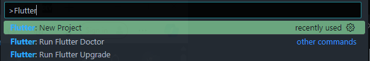
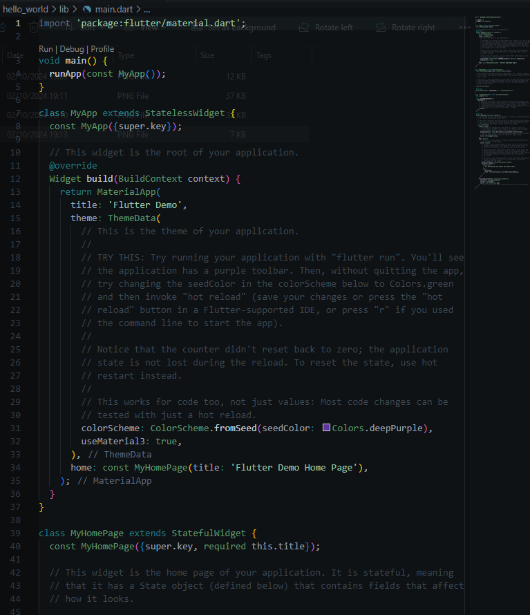
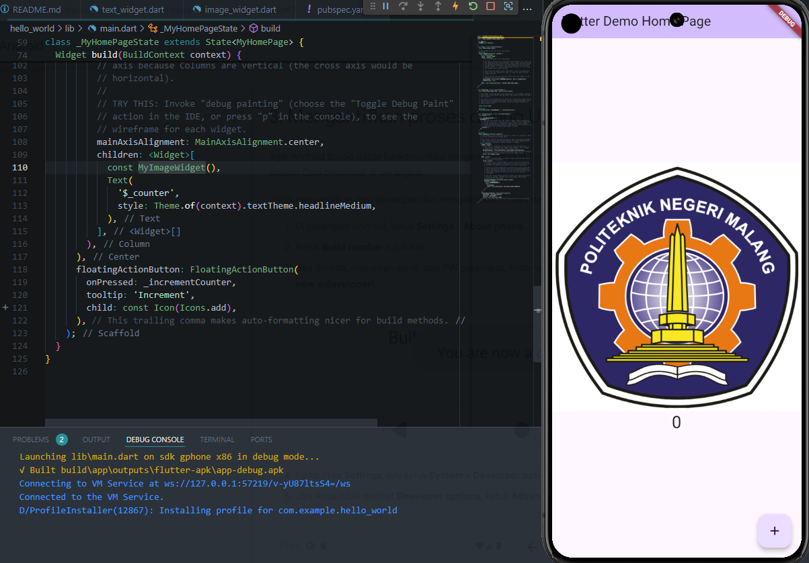

# **#05 | Aplikasi Pertama dan Widget Dasar Flutter**

**NIM** = 2241720056

**Nama** = Dhika Wahyu Nugroho

**Kelas** = TI-3F

**No Absen** = 06

# Praktikum 1: Membuat Project Flutter Baru

## Langkah 1

## Langkah 2

## Langkah 3

## Langkah 4

# Praktikum 2: Membuat Project Flutter Baru

## Langkah 1

# Praktikum 3: Membuat Repository GitHub dan Laporan Praktikum

## Langkah 3 - 10

## Langkah 11

## Langkah 12

# Praktikum 4: Menerapkan Widget Dasar

## Langkah 1: Text Widged

## Langkah 2: Image Widget

# Praktikum 5: Menerapkan Widget Material Design dan iOS Cupertino

## Langkah 1: Cupertino Button dan Loading Bar

## Langkah 2: Floating Action Button (FAB)

## Langkah 3: Scaffold Widget

## Langkah 4: Dialog Widget

## Langkah 5: Input dan Selection Widget

## Langkah 6: Date and Time Pickers

# Tugas Praktikum

## Membuat Project Baru (flutter_application_1)

## Pada pubspec.yaml

## Pada analysis_options.yaml

## Pada main.dart

## Hasil dari main.dart

## Adding a button

## Pemanggilan getNext() Button

## Make the app prettier

## Add functionality

## Add navigation rail

## Add a new page

