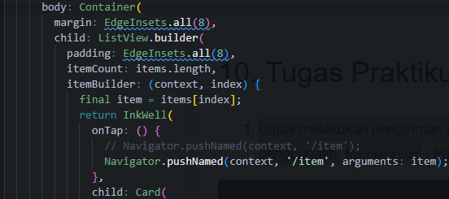
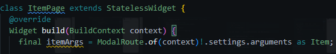
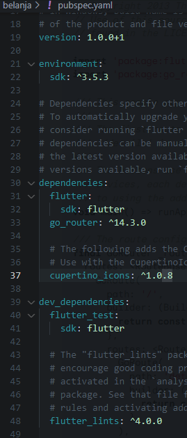

# **#06 | Layout dan Navigasi**

**NIM** = 2241720056

**Nama** = Dhika Wahyu Nugroho

**Kelas** = TI-3F

**No Absen** = 06

# Praktikum 1: Membangun Layout di Flutter

## Langkah 1: Buat Project Baru

  

## Langkah 2: Buka file lib/main.dart

## Langkah 3: Identifikasi layout diagram

## Langkah 4: Implementasi title row
 
- Pada soal 1 memberikan padding keseluruhan dan memberikan CrossAxisAlignment.start untuk menempatkan kolom di awal baris.
- Pada soal 2 memberikan padding pada area bawah dan memberikan warna abu-abu untuk text 'Batu, Malang, Indonesia'.
- Pada soal 3 memanggil icon star dengan berwarna merah.

# Praktikum 2: Implementasi button row

## Langkah 1: Buat method Column _buildButtonColumn

## Langkah 2: Buat widget buttonSection

## Langkah 3: Tambah button section ke body

# Praktikum 3: Implementasi text section

## Langkah 1

## Langkah 2

# Praktikum 4: Implementasi image section

## Langkah 1: Siapkan aset gambar

## Langkah 2: Tambahkan gambar ke body

## Langkah 3: Terakhir, ubah menjadi ListView
 
- Penggunaan ListView digunakan untuk konten yang dinamis sehingga cocok untuk ukuran layar yang mungkin melebihi.

# Tugas Praktikum 1
- **Full Code main.dart**
    ~~~dart
    import 'package:flutter/material.dart';

    void main() {
    runApp(const MyApp());
    }

    class MyApp extends StatelessWidget {
    const MyApp({super.key});

    @override
    Widget build(BuildContext context) {
        Column _buildInfoColumn(String label, String value) {
        return Column(
            crossAxisAlignment: CrossAxisAlignment.start,
            children: [
            Text(
                label,
                style: TextStyle(
                fontWeight: FontWeight.bold,
                color: Colors.black,
                ),
            ),
            SizedBox(height: 4),
            Text(
                value,
                style: TextStyle(
                color: Colors.grey[600],
                ),
            ),
            ],
        );
        }

        final stars = Row(
        mainAxisSize: MainAxisSize.min,
        children: [
            Icon(Icons.star, color: Colors.green[500]),
            Icon(Icons.star, color: Colors.green[500]),
            Icon(Icons.star, color: Colors.green[500]),
            const Icon(Icons.star, color: Colors.black),
            const Icon(Icons.star, color: Colors.black),
        ],
        );

        final ratings = Container(
        padding: const EdgeInsets.all(8),
        child: Row(
            mainAxisAlignment: MainAxisAlignment.spaceEvenly,
            children: [
            stars,
            const Text(
                '170 Reviews',
                style: TextStyle(
                color: Colors.black,
                fontWeight: FontWeight.w800,
                fontFamily: 'Roboto',
                letterSpacing: 0.5,
                fontSize: 14,
                ),
            ),
            ],
        ),
        );

        const descTextStyle = TextStyle(
        color: Colors.black,
        fontWeight: FontWeight.w800,
        fontFamily: 'Roboto',
        letterSpacing: 0.5,
        fontSize: 13,
        height: 2,
        );

        final iconList = DefaultTextStyle.merge(
        style: descTextStyle,
        child: Container(
            padding: const EdgeInsets.all(4),
            child: Row(
            mainAxisAlignment: MainAxisAlignment.spaceEvenly,
            children: [
                Column(
                children: [
                    Icon(Icons.kitchen, color: Colors.green[500]),
                    const Text('PREP:'),
                    const Text('23 min'),
                ],
                ),
                Column(
                children: [
                    Icon(Icons.timer, color: Colors.green[500]),
                    const Text('COOK:'),
                    const Text('30 min'),
                ],
                ),
                Column(
                children: [
                    Icon(Icons.restaurant, color: Colors.green[500]),
                    const Text('FEEDS:'),
                    const Text('4-6'),
                ],
                ),
            ],
            ),
        ),
        );

        return MaterialApp(
        title: 'Flutter Basic Layout: Dhika Wahyu Nugroho - 2241720056',
        theme: ThemeData(
            colorScheme: ColorScheme.fromSeed(seedColor: Colors.deepPurple),
            useMaterial3: true,
        ),
        home: Scaffold(
            appBar: AppBar(
            title: const Text('Pancakes: Dhiyun - 2241720056'),
            ),
            body: Padding(
            padding: const EdgeInsets.all(16.0),
            child: Row(
                crossAxisAlignment: CrossAxisAlignment.start,
                children: [
                Container(
                    width: MediaQuery.of(context).size.width * 0.35,
                    child: Column(
                    crossAxisAlignment: CrossAxisAlignment.start,
                    children: [
                        Align(
                        alignment: Alignment.center,
                        child: Text(
                            'Fluffy Pancakes Review',
                            style: TextStyle(
                            fontWeight: FontWeight.bold,
                            fontSize: 24,
                            color: Colors.black87,
                            ),
                            textAlign: TextAlign.center,
                        ),
                        ),
                        SizedBox(height: 8),
                        Text(
                        'A stack of warm, '
                        'fluffy pancakes are sure to bring '
                        'smiles to even the groggiest early morning risers.',
                        style: TextStyle(fontSize: 16),
                        textAlign: TextAlign.center,
                        ),
                        SizedBox(height: 16),
                        ratings,
                        SizedBox(height: 16),
                        iconList,
                    ],
                    ),
                ),
                SizedBox(width: 16),
                Container(
                    width: MediaQuery.of(context).size.width * 0.57,
                    color: Colors.blueGrey[50],
                    child: Image.asset(
                    'assets/img/FluffyPancakes.jpeg',
                    fit: BoxFit.cover,
                    ),
                ),
                ],
            ),
            ),
        ),
        );
    }
    }
    ~~~

- Pada kode tersebut terdapat 2 container untuk bagian Text yaitu penjelasan dan judul pada sisi kiri dan terdapat tampilan gambar dari penjelasan Teks tersebut di sisi kanan.

- **Output Tugas Praktikum 1** 

# Praktikum 5: Membangun Navigasi di Flutter

## Langkah 1: Siapkan project baru

## Langkah 2: Mendefinisikan Route

## Langkah 3: Lengkopi Kode di main.dart

## Langkah 4: Membuat data model

## Langkah 5: Lengkapi kode di class HomePage

## Langkah 6: Membuat ListView dan itemBuilder

## Langkah 7: Menambahkan aksi pada ListView

- Terdapat exception ketika di klik salah satu item pada list dikarenakan pada halaman target yang di tuju, belum memiliki sebuah Widget body atau layout jadi hasilnya akan seperti berikut:

# Tugas Praktikum 2

## Soal 1: Untuk melakukan pengiriman data ke halaman berikutnya, cukup menambahkan informasi arguments pada penggunaan Navigator. Perbarui kode pada bagian Navigator menjadi seperti berikut.

- Menambahkan kode tersebut agar bisa melakukan perpindahan page, serta argument menyesuaikan dengan item yang dipilih.

## Soal 2: Pembacaan nilai yang dikirimkan pada halaman sebelumnya dapat dilakukan menggunakan ModalRoute. Tambahkan kode berikut pada blok fungsi build dalam halaman ItemPage. Setelah nilai didapatkan, anda dapat menggunakannya seperti penggunaan variabel pada umumnya. (https://docs.flutter.dev/cookbook/navigation/navigate-with-arguments)

- Pada kode tersebut digunakan untuk menangkap argumen yang dikirim dari halaman sebelumnya.

- **Full Code ItemPage.dart** 

- **Output Home** 

- **Output Peritem** 

## Soal 3: Pada hasil akhir dari aplikasi belanja yang telah anda selesaikan, tambahkan atribut foto produk, stok, dan rating. Ubahlah tampilan menjadi GridView seperti di aplikasi marketplace pada umumnya.
- **Full Code item.dart** 
    ~~~dart
    class Item {
        final String name;
        final int price;
        final String imgprdct;
        final int stok;
        final double rating;

        Item({
            required this.name,
            required this.price,
            required this.imgprdct,
            required this.stok,
            required this.rating,
        });
    }
    ~~~

- **Full Code item_page.dart** 
    ~~~dart
    import 'package:flutter/material.dart';
    import '../models/item.dart';

    class ItemPage extends StatelessWidget {
    @override
    Widget build(BuildContext context) {
        final itemArgs = ModalRoute.of(context)!.settings.arguments as Item;

        return Scaffold(
        appBar: AppBar(
            title: Text('Detail Item'),
        ),
        body: Padding(
            padding: const EdgeInsets.all(16.0),
            child: Column(
            crossAxisAlignment: CrossAxisAlignment.start,
            children: [
                ClipRRect(
                borderRadius: BorderRadius.circular(10.0),
                child: Image.asset(
                    itemArgs.imgprdct,
                    height: 200,
                    width: double.infinity,
                    fit: BoxFit.cover,
                ),
                ),
                SizedBox(height: 16),
                Row(
                mainAxisAlignment: MainAxisAlignment.spaceBetween,
                children: [
                    Expanded(
                    child: Text(
                        itemArgs.name,
                        style: TextStyle(fontSize: 24, fontWeight: FontWeight.bold),
                        overflow: TextOverflow.ellipsis,
                    ),
                    ),
                    Text(
                    'Stock: ${itemArgs.stok}',
                    style: TextStyle(color: Colors.grey, fontSize: 16),
                    ),
                ],
                ),
                SizedBox(height: 8),
                Text(
                'Price: Rp${itemArgs.price}',
                style: TextStyle(fontSize: 18, fontWeight: FontWeight.w500),
                ),
                SizedBox(height: 10),
                Row(
                children: [
                    Row(
                    children: List.generate(5, (index) {
                        return Icon(
                        index < itemArgs.rating.round()
                            ? Icons.star
                            : Icons.star_border,
                        color: const Color.fromARGB(255, 50, 116, 52),
                        size: 20,
                        );
                    }),
                    ),
                    SizedBox(width: 8),
                    Text(
                    '${itemArgs.rating}',
                    style: TextStyle(fontSize: 16),
                    ),
                ],
                ),
                SizedBox(height: 16),
            ],
            ),
        ),
        );

        // TODO : Implement build
        throw UnimplementedError();
        }
    }
    ~~~

- **Tambahan Code home_page.dart**
    ~~~dart
    final List<Item> items = [
      Item(
          name: 'Sugar',
          price: 5000,
          imgprdct: 'assets/img/Sugar.jpeg',
          stok: 5,
          rating: 4.4),
      Item(
          name: 'Salt',
          price: 2000,
          imgprdct: 'assets/img/Salt.jpeg',
          stok: 15,
          rating: 4.7),
    ];
    ~~~

- **Output item_page.dart** 

## Soal 4: Pada hasil akhir dari aplikasi belanja yang telah anda selesaikan, tambahkan atribut foto produk, stok, dan rating. Ubahlah tampilan menjadi GridView seperti di aplikasi marketplace pada umumnya.
- **Tambahan Code home_page.dart** 
    ~~~dart
    return InkWell(
        onTap: () {
        // Navigator.pushNamed(context, '/item');
        Navigator.pushNamed(context, '/item', arguments: item);
        },
        child: Card(
        child: Container(
            margin: EdgeInsets.all(8),
            child: Row(
            children: [
                Hero(
                tag: item.imgprdct,
                child: ClipRRect(
                    borderRadius: BorderRadius.circular(10.0),
                    child: Image.asset(
                    item.imgprdct,
                    height: 75,
                    width: 75,
                    fit: BoxFit.cover,
                    ),
                ),
                ),
                SizedBox(width: 16),
                Expanded(child: Text(item.name)),
                Expanded(
                child: Text(
                    item.price.toString(),
                    textAlign: TextAlign.end,
                ),
                ),
            ],
            ),
        ),
        ),
    );
    ~~~
- **Tambahan Code item_page.dart Pada Bagian Image** 
    ~~~dart
    Hero(
        tag: itemArgs.imgprdct,
        child: ClipRRect(
        borderRadius: BorderRadius.circular(10.0),
        child: Image.asset(
            itemArgs.imgprdct,
            height: 200,
            width: double.infinity,
            fit: BoxFit.cover,
        ),
        ),
    ),
    SizedBox(height: 16),
    ~~~
- Penggunaan Hero pada kedua halaman yang berbeda saling berkaitan ketika penggunaan tag yang sama. Ketika mengklik item, gambar akan teredapat animasi.

## Soal 5: Sesuaikan dan modifikasi tampilan sehingga menjadi aplikasi yang menarik. Selain itu, pecah widget menjadi kode yang lebih kecil. Tambahkan **Nama** dan **NIM** di footer aplikasi belanja Anda.
- **Full Code File home_page.dart** 
    ~~~dart
    import 'package:flutter/material.dart';
    import '../models/item.dart';
    import '../widgets/footer.dart';

    class HomePage extends StatelessWidget {
    @override
    Widget build(BuildContext context) {
        final List<Item> items = [
        Item(
            name: 'Sugar',
            price: 5000,
            imgprdct: 'assets/img/Sugar.jpeg',
            stok: 5,
            rating: 4.4),
        Item(
            name: 'Salt',
            price: 2000,
            imgprdct: 'assets/img/Salt.jpeg',
            stok: 15,
            rating: 4.7),
        ];

        return Scaffold(
        appBar: AppBar(
            title: Text('Item List'),
        ),
        body: Container(
            margin: EdgeInsets.all(8),
            child: ListView.builder(
            padding: EdgeInsets.all(8),
            itemCount: items.length,
            itemBuilder: (context, index) {
                final item = items[index];
                return ItemCard(item: item);
            },
            ),
        ),
        bottomNavigationBar: const Footer(),
        );
    }
    }

    class ItemCard extends StatelessWidget {
    final Item item;

    const ItemCard({Key? key, required this.item}) : super(key: key);

    @override
    Widget build(BuildContext context) {
        return InkWell(
        onTap: () {
            Navigator.pushNamed(context, '/item', arguments: item);
        },
        child: Card(
            child: Container(
            margin: EdgeInsets.all(8),
            child: Row(
                children: [
                Hero(
                    tag: item.imgprdct,
                    child: ClipRRect(
                    borderRadius: BorderRadius.circular(10.0),
                    child: Image.asset(
                        item.imgprdct,
                        height: 75,
                        width: 75,
                        fit: BoxFit.cover,
                    ),
                    ),
                ),
                SizedBox(width: 16),
                Expanded(child: Text(item.name)),
                Expanded(
                    child: Text(
                    item.price.toString(),
                    textAlign: TextAlign.end,
                    ),
                ),
                ],
            ),
            ),
        ),
        );
    }
    }
    ~~~

- Pada kode di atas terdapat widget yang dipisah untuk membentuk sebauh card pada masing masing item.

- **Full Code File item_page.dart** 
    ~~~dart
    import 'package:flutter/material.dart';
    import '../models/item.dart';
    import '../widgets/footer.dart';

    class ItemPage extends StatelessWidget {
    @override
    Widget build(BuildContext context) {
        final itemArgs = ModalRoute.of(context)!.settings.arguments as Item;

        return Scaffold(
        appBar: AppBar(
            title: Text('Detail Item'),
        ),
        body: Padding(
            padding: const EdgeInsets.all(16.0),
            child: ItemDetails(item: itemArgs),
        ),
        bottomNavigationBar: const Footer(),
        );

        // TODO : Implement build
        throw UnimplementedError();
    }
    }

    class ItemDetails extends StatelessWidget {
    final Item item;

    const ItemDetails({Key? key, required this.item}) : super(key: key);

    @override
    Widget build(BuildContext context) {
        return Column(
        crossAxisAlignment: CrossAxisAlignment.start,
        children: [
            ItemDetailImage(imagePath: item.imgprdct),
            SizedBox(height: 16),
            ItemDetailInfo(item: item),
            SizedBox(height: 16),
        ],
        );
    }
    }

    class ItemDetailImage extends StatelessWidget {
    final String imagePath;

    const ItemDetailImage({Key? key, required this.imagePath}) : super(key: key);

    @override
    Widget build(BuildContext context) {
        return Hero(
        tag: imagePath,
        child: ClipRRect(
            borderRadius: BorderRadius.circular(10.0),
            child: Image.asset(
            imagePath,
            height: 200,
            width: double.infinity,
            fit: BoxFit.cover,
            ),
        ),
        );
    }
    }

    class ItemDetailInfo extends StatelessWidget {
    final Item item;

    const ItemDetailInfo({Key? key, required this.item}) : super(key: key);

    @override
    Widget build(BuildContext context) {
        return Column(
        crossAxisAlignment: CrossAxisAlignment.start,
        children: [
            Row(
            mainAxisAlignment: MainAxisAlignment.spaceBetween,
            children: [
                Expanded(
                child: Text(
                    item.name,
                    style: TextStyle(fontSize: 24, fontWeight: FontWeight.bold),
                    overflow: TextOverflow.ellipsis,
                ),
                ),
                Text(
                'Stock: ${item.stok}',
                style: TextStyle(color: Colors.grey, fontSize: 16),
                ),
            ],
            ),
            SizedBox(height: 8),
            Text(
            'Price: Rp${item.price}',
            style: TextStyle(fontSize: 18, fontWeight: FontWeight.w500),
            ),
            SizedBox(height: 10),
            RatingStars(rating: item.rating),
        ],
        );
    }
    }

    class RatingStars extends StatelessWidget {
    final double rating;

    const RatingStars({Key? key, required this.rating}) : super(key: key);

    @override
    Widget build(BuildContext context) {
        return Row(
        children: [
            Row(
            children: List.generate(5, (index) {
                return Icon(
                index < rating.round() ? Icons.star : Icons.star_border,
                color: const Color.fromARGB(255, 50, 116, 52),
                size: 20,
                );
            }),
            ),
            SizedBox(width: 8),
            Text(
            '$rating',
            style: TextStyle(fontSize: 16),
            ),
        ],
        );
    }
    }
    ~~~

- Pada kode di atas terdapat widget yang dipisah untuk masing masing bagian agar lebih terstruktur seperti pada bagian dari class RatingStars akan dipanggil di dalam class ItemDetailInfo.

- **Membuat File footer.dart di dalam Folder widgets** 
    ~~~dart
    import 'package:flutter/material.dart';

    class Footer extends StatelessWidget {
    const Footer({Key? key}) : super(key: key);

    @override
    Widget build(BuildContext context) {
        return Container(
        color: Colors.grey[200],
        height: 50,
        child: Center(
            child: Text(
            'Dhika Wahyu - 2241720056',
            style: const TextStyle(fontSize: 16, color: Colors.black),
            ),
        ),
        );
    }
    }
    ~~~

- **Pemanggilan footer Pada home_page.dart dan item_page.dart di dalam Scaffold** 
    ~~~dart
    import '../widgets/footer.dart';

    return Scaffold(
      bottomNavigationBar: const Footer(),
    );
    ~~~

- **Output Home** 

- **Output Peritem** 

## Soal 6: Selesaikan Praktikum 5: Navigasi dan Rute tersebut. Cobalah modifikasi menggunakan plugin go_router,
- **Menambahkan Kode File pubspec.lock** 

- **Pada Terminal Melakukan 'flutter pub get'** 

- **Modifikasi File main.dart** 
    ~~~dart
    void main() {
    final GoRouter _router = GoRouter(
        routes: <RouteBase>[
        GoRoute(
            path: '/',
            builder: (BuildContext context, GoRouterState state) {
                return HomePage();
            },
            routes: <RouteBase>[
                GoRoute(
                path: 'item',
                builder: (BuildContext context, GoRouterState state) {
                    final itemArgs = state.extra as Item;
                    return ItemPage(item: itemArgs);
                },
                ),
            ]),
        ],
    );

    runApp(MaterialApp.router(
        // initialRoute: '/',
        // routes: {
        //   '/': (context) => HomePage(),
        //   '/item': (context) => ItemPage(),
        // }
        routerConfig: _router,
    ));
    }
    ~~~

- **Modefikasi File home_page.dart Bagian Route** 
    ~~~dart
    onTap: () {
        context.go('/item', extra: item);
    },
    ~~~

- **Modefikasi File item_page.dart Penambahan Parameter** 
    ~~~dart
    class ItemPage extends StatelessWidget {
        final Item item;

        const ItemPage({Key? key, required this.item}) : super(key: key);
        
        @override
        Widget build(BuildContext context) {
            return Scaffold(
            appBar: AppBar(
                title: Text('Detail Item'),
            ),
            body: Padding(
                padding: const EdgeInsets.all(16.0),
                child: ItemDetails(item: item),
            ),
            bottomNavigationBar: const Footer(),
            );

            // TODO : Implement build
            throw UnimplementedError();
        }
    }
    ~~~
    
- **Output HomePage** 

- **Output ItemPage** 

