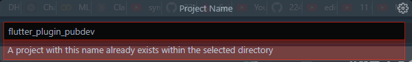
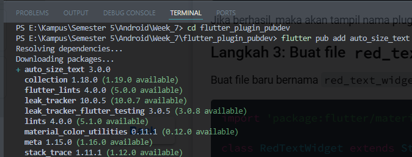
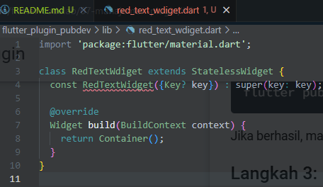
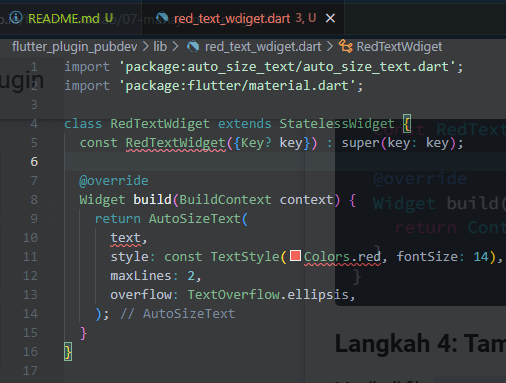
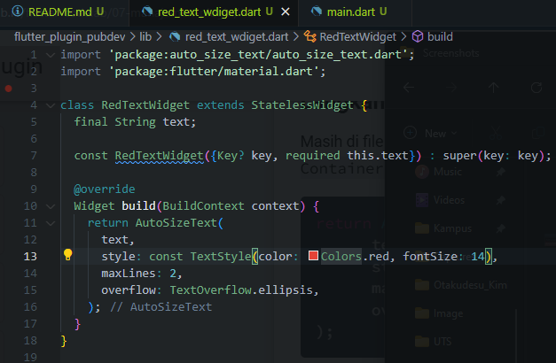
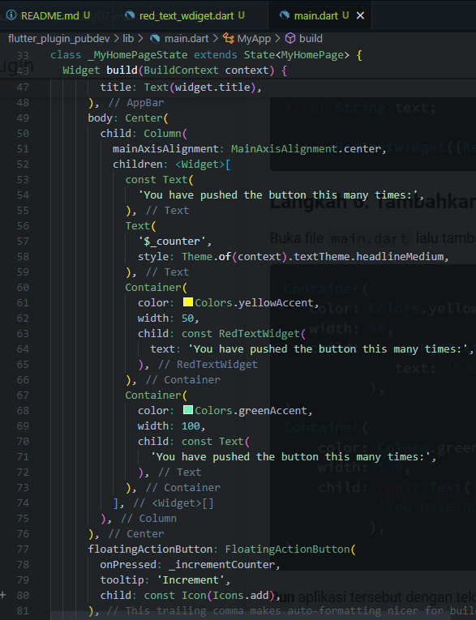
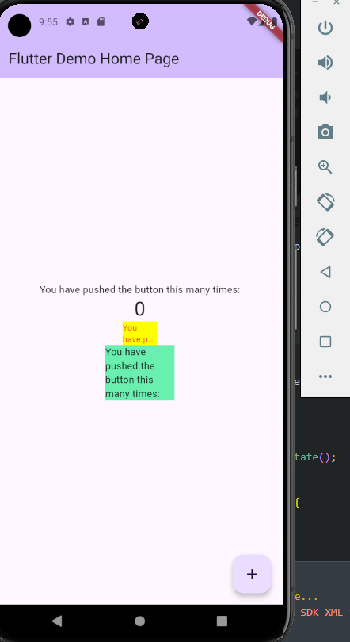

# **#07 | Manajemen Plugin**

**NIM** = 2241720056

**Nama** = Dhika Wahyu Nugroho

**Kelas** = TI-3F

**No Absen** = 06

# Praktikum Menerapkan Plugin di Project Flutter

## Langkah 1: Buat Project Baru

 

## Langkah 2: Menambahkan Plugin
 
- Pada Langkah 2 adalah menambahkan pluigin auto_size_text pada project tersebut.

## Langkah 3: Buat file red_text_widget.dart
 

## Langkah 4: Tambah Widget AutoSizeText
 

## Langkah 5: Buat Variabel text dan parameter di constructor
 
- Pada Langkah 5 adalah membuat variabel text dan parameter constructor agar widget RedTextWidget dapat menerima text sebagai input.

## Langkah 6: Tambahkan widget di main.dart
 
 
- Pada Langkah 6 terdapat Container untuk mengatur warna dan
juga ukuran layout. Terdapat penggunaan RedTextWidget 
untuk menampilkan teks secara kustom dengan parameter yang disediakan.
Menggunakan Teks untuk menampilkan teks biasa pada flutter.

- Jelaskan maksud dari tiap parameter yang ada di dalam plugin
auto_size_text berdasarkan tautan pada dokumentasi ini !
    - key: Mengontrol bagaimana satu widget menggantikan widget lain dalam widget tree.
    - textKey: Menetapkan key untuk widget teks yang dihasilkan.
    - style: Gaya teks, seperti ukuran, warna, dan ketebalan font.
    - minFontSize: Ukuran minimum teks saat menyesuaikan ukuran otomatis, diabaikan jika presetFontSizes disetel.
    - maxFontSize: Ukuran maksimum teks, diabaikan jika presetFontSizes disetel.
    - stepGranularity: Langkah perubahan ukuran font untuk menyesuaikan dengan ruang yang tersedia.
    - presetFontSizes: Daftar ukuran font yang sudah ditentukan (harus dalam urutan menurun).
    - group: Menyinkronkan ukuran beberapa AutoSizeText.
    - textAlign: Mengatur perataan teks secara horizontal (kiri, kanan, tengah, dll).
    - textDirection: Menentukan arah teks (LTR atau RTL), yang memengaruhi interpretasi alignment.
    - locale: Memilih font yang sesuai berdasarkan lokal teks.
    - softWrap: Menentukan apakah teks harus dipisah di soft line breaks.
    - wrapWords: Menentukan apakah kata-kata yang tidak muat di satu baris akan dipisah (default-nya true).
    - overflow: Mengatur bagaimana overflow visual teks ditangani.
    - overflowReplacement: Widget yang ditampilkan jika teks tidak muat dan melampaui batas.
    - textScaleFactor: Faktor skala teks, memengaruhi ukuran minFontSize, maxFontSize, dan presetFontSizes.
    - maxLines: Jumlah maksimum baris yang bisa digunakan untuk menampilkan teks.
    - semanticsLabel: Label semantik alternatif untuk teks tersebut, berguna untuk aksesibilitas.
