# **#09 | Kamera**

**NIM** = 2241720056

**Nama** = Dhika Wahyu Nugroho

**Kelas** = TI-3F

**No Absen** = 06

# Praktikum 1: Mengambil Foto dengan Kamera di Flutter

## Langkah 1: Buat Project Baru

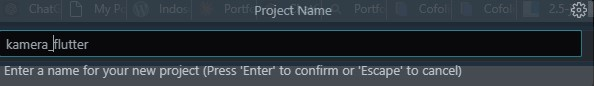 

## Langkah 2: Tambah dependensi yang diperlukan

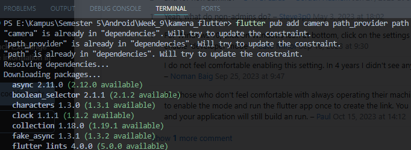 

## Langkah 3: Ambil Sensor Kamera dari device

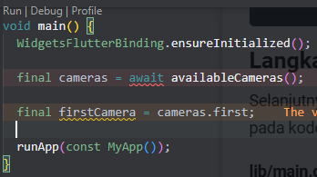 

- Ubah void main()  
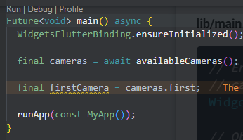 

- Akses Camera
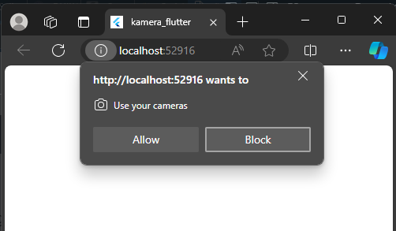 

## Langkah 4: Buat dan inisialisasi CameraController

- Pada file 'lib/widget/takepicture_screen.dart' ketik kode berikut. 
    ~~~dart
    import 'package:camera/camera.dart';
    import 'package:flutter/material.dart';

    class TakePictureScreen extends StatefulWidget {
        const TakePictureScreen({
            super.key,
            required this.camera,
        });

        final CameraDescription camera;

        @override
        TakePictureScreenState createState() => TakePictureScreenState();
        }

        class TakePictureScreenState extends State<TakePictureScreen> {
        late CameraController _controller;
        late Future<void> _initializeControllerFuture;

        @override
        void initState() {
            super.initState();

            _controller = CameraController(
            widget.camera,
            ResolutionPreset.medium,
            );

            _initializeControllerFuture = _controller.initialize();
        }

        @override
        void dispose() {
            _controller.dispose();
            super.dispose();
        }

        @override
        Widget build(BuildContext context) {
            return Container();
        }
    }
    ~~~

## Langkah 5: Gunakan CameraPreview untuk menampilkan preview foto

- Pada file 'lib/widget/takepicture_screen.dart' bagian Widget build ubah menjadi seperti berikut.  
    ~~~dart
    @override
    Widget build(BuildContext context) {
        return Scaffold(
        appBar: AppBar(title: const Text('Take a picture - 2241720056')),
        body: FutureBuilder<void>(
            future: _initializeControllerFuture,
            builder: (context, snapshot) {
                if (snapshot.connectionState == ConnectionState.done) {
                return CameraPreview(_controller);
                } else {
                return const Center(
                    child: CircularProgressIndicator(),
                );
                }
            }),
        );
    }
    ~~~

## Langkah 6: Ambil foto dengan CameraController

- Pada file'lib/widget/takepicture_screen.dart' setelah field body, menambahkan kode berikut.  
    ~~~dart
    floatingActionButton: FloatingActionButton(
        onPressed: () async {
            try {
            await _initializeControllerFuture;

            final image = await _controller.takePicture();
            } catch (e) {
            print(e);
            }
        },
        child: const Icon(Icons.camera_alt),
    ),
    ~~~

## Langkah 7: Buat widget baru DisplayPictureScreen

- Buatlah file baru pada folder widget yang berisi kode berikut.  
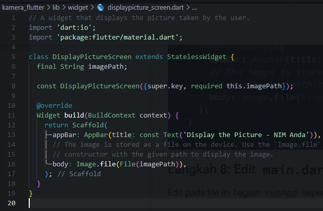 

## Langkah 8: Edit main.dart
- Edit pada file ini bagian runApp seperti kode berikut.  
    ~~~dart
    runApp(
        MaterialApp(
        theme: ThemeData.dark(),
        home: TakePictureScreen(
            // Pass the appropriate camera to the TakePictureScreen widget.
            camera: firstCamera,
        ),
        debugShowCheckedModeBanner: false,
        ),
    );
    ~~~

## Langkah 9: Menampilkan hasil foto

- Tambahkan kode seperti berikut pada bagian try / catch agar dapat menampilkan hasil foto pada DisplayPictureScreen.  
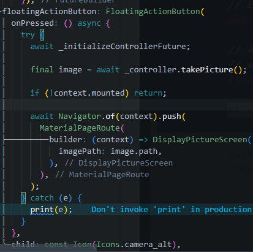 

## Hasil Output

- Camera  
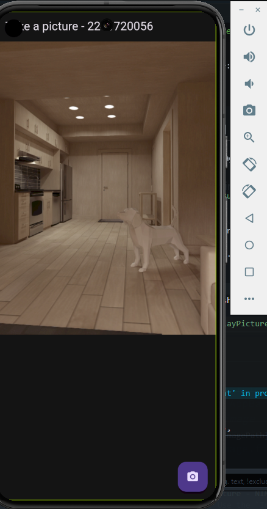 
- Output  
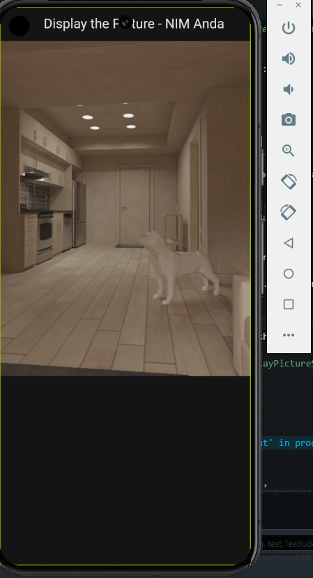 

# Praktikum 2: Membuat photo filter carousel

## Langkah 1: Buat project baru

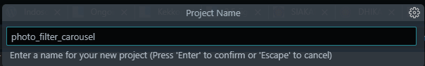 

## Langkah 2: Buat widget Selector ring dan dark gradient

- Buatlah folder widget dan file baru bernama filter_selector.dart yang berisi kode berikut. 
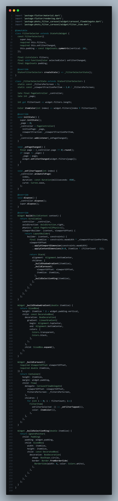 

## Langkah 3: Buat widget photo filter carousel

- Buat file baru bernama filter_carousel.dart di folder widget dengan kode seperti berikut. 
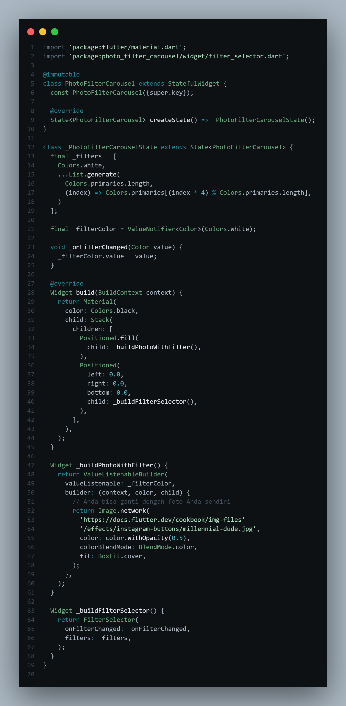 

## Langkah 4: Membuat filter warna - bagian 1

- Buat file baru bernama carousel_flowdelegate.dart di folder widget seperti kode berikut. 
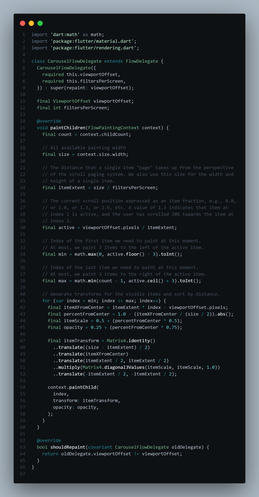 

## Langkah 5: Membuat filter warna

- Buat file baru bernama filter_item.dart di folder widget seperti kode berikut ini.
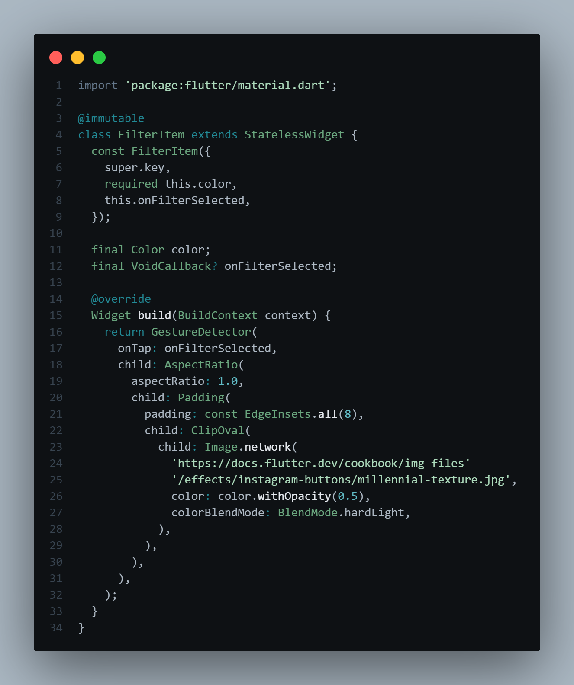 

## Langkah 6: Implementasi filter carousel

- Terakhir, kita impor widget PhotoFilterCarousel ke main seperti kode berikut ini.
    ~~~dart
    void main() {
        runApp(
            const MaterialApp(
            home: PhotoFilterCarousel(),
            debugShowCheckedModeBanner: false,
            ),
        );
    }
    ~~~

- Filter Camera
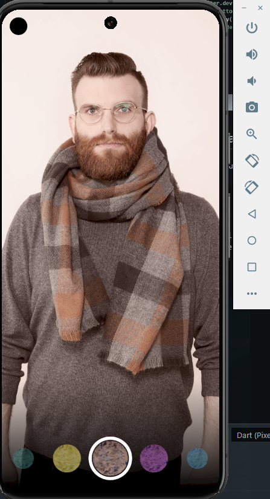 

## Tugas Praktikum

- Gabungkan hasil praktikum 1 dengan hasil praktikum 2 sehingga setelah melakukan pengambilan foto, dapat dibuat filter carouselnya! 'Saya menggunakan praktikum 2 untuk penggabungannya.'  

    - Pada main.dart gunakan file main pada praktikum 1, seperti berikut:
        ~~~dart
        Future<void> main() async {
            WidgetsFlutterBinding.ensureInitialized();

            final cameras = await availableCameras();

            final firstCamera = cameras.first;

            runApp(
                MaterialApp(
                theme: ThemeData.dark(),
                home: TakePictureScreen(
                    // Pass the appropriate camera to the TakePictureScreen widget.
                    camera: firstCamera,
                ),
                debugShowCheckedModeBanner: false,
                ),
            );
        }
        ~~~

    - Pada displaypicture_screen.dart sesuaikan seperti berikut:
        ~~~dart
        import 'package:flutter/material.dart';
        import 'package:photo_filter_carousel/widget/filter_carousel.dart';

        class DisplayPictureScreen extends StatelessWidget {
            final String imagePath;

            const DisplayPictureScreen({super.key, required this.imagePath});

            @override
            Widget build(BuildContext context) {
                return Scaffold(
                appBar: AppBar(title: const Text('Display the Picture - 2241720056')),
                // The image is stored as a file on the device. Use the `Image.file`
                // constructor with the given path to display the image.
                body: PhotoFilterCarousel(imagePath: imagePath),
                );
            }
        }
        ~~~

    - Pada displaypicture_screen.dart sesuaikan seperti berikut:
        ~~~dart
        import 'package:flutter/material.dart';
        import 'package:photo_filter_carousel/widget/filter_carousel.dart';

        class DisplayPictureScreen extends StatelessWidget {
            final String imagePath;

            const DisplayPictureScreen({super.key, required this.imagePath});

            @override
            Widget build(BuildContext context) {
                return Scaffold(
                appBar: AppBar(title: const Text('Display the Picture - 2241720056')),
                // The image is stored as a file on the device. Use the `Image.file`
                // constructor with the given path to display the image.
                body: PhotoFilterCarousel(imagePath: imagePath),
                );
            }
        }
        ~~~

    - Pada filter_carsusel.dart sesuaikan seperti berikut:
        ~~~dart
        Widget _buildPhotoWithFilter() {
            return ValueListenableBuilder(
                valueListenable: _filterColor,
                builder: (context, color, child) {
                    // Anda bisa ganti dengan foto Anda sendiri
                    return Image.file(
                    File(widget.imagePath),
                    color: color.withOpacity(0.5),
                    colorBlendMode: BlendMode.color,
                    fit: BoxFit.cover,
                    );
                },
            );
        }
        ~~~

    - Output Takepicture 
        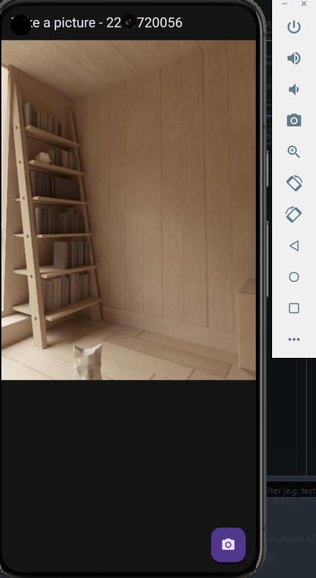 
    - Output Filterpucture 
        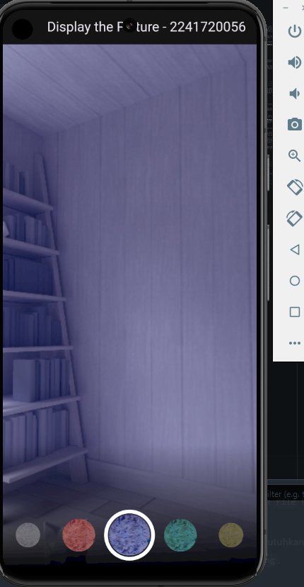 

- Jelaskan maksud void async pada praktikum 1?
    - **Jawaban**: void async berjalan secara asyncronus (proses yang lain tidak perlu menunggu atau tidak memblokir proses lain) dengan tidak mengembalikan nilai.

- Jelaskan fungsi dari anotasi @immutable dan @override ?
    - **Jawaban**: Immutable menandakan tidak mengubah kelas atau objek. Override menandakan metode atau properti pada subclass menggantikan implementasi dari superclass.
